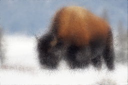
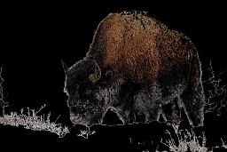
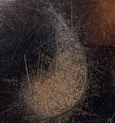
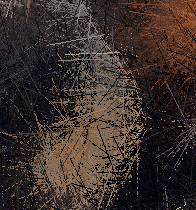
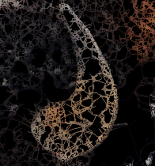

# line-splat

**line-splat** is a command line tool that stylizes images by drawing lines. It supports JPEG and PNG images and works best on images that are at least 1920x1080.

The various styles are based off of some whiteboard doodles I did while brain storming for another project.

## Examples

+---------------+-------------------------------------+--------------------------------------+-------------------------------------+-----------------+
|  |  |  |  |  |
+---------------+-------------------------------------+--------------------------------------+-------------------------------------+-----------------+
|  |  |  |  |  |
+---------------+-------------------------------------+--------------------------------------+-------------------------------------+-----------------+
| [Full Size](examples/original.jpg) | [Full Size](examples/random.png) | [Full Size](examples/steered.png) | [Full Size](examples/energy.png) | [Full Size](examples/edgeweb.png) |
+---------------+-------------------------------------+--------------------------------------+-------------------------------------+-----------------+
| Original [^1] | --line-count=1000000 --style=random | --line-count=1000000 --style=steered | --line-count=1000000 --style=energy | --style=edgeweb |
+---------------+-------------------------------------+--------------------------------------+-------------------------------------+-----------------+

[^1]: [Yellowstone_2013 02 05_0452](https://www.flickr.com/photos/hbarrison/8491286056/) is copyright (c) 2013, Harvey Barrison. Used under the [CC BY-NC-SA 2.0 license](https://creativecommons.org/licenses/by-nc-sa/2.0/).

## Building

Building line-splat requires [Rust](https://www.rust-lang.org/en-US/) 1.19 or later. Navigate to the base directory and run

`cargo build --release`

to compile the program. The executable can then be found with the name `line-splat` in the `target/release/` directory.

## Usage

`text
line-splat 0.1
James Bendig
Stylize images by drawing random lines. Supports JPEG and PNG images.

USAGE:
    line-splat [OPTIONS] <INPUT> <OUTPUT>

FLAGS:
    -h, --help       Prints help information
    -V, --version    Prints version information

OPTIONS:
    -l, --line-count <line-count>    Number of lines to draw [default: 1000000]
    -s, --style <style>              Style to use. Must be random, steered, energy, or edgeweb. [default: random]

ARGS:
    <INPUT>     Input image file
    <OUTPUT>    Output image file
`

## License

line-splat is licensed under the MIT license. See [LICENSE](LICENSE) for details.
